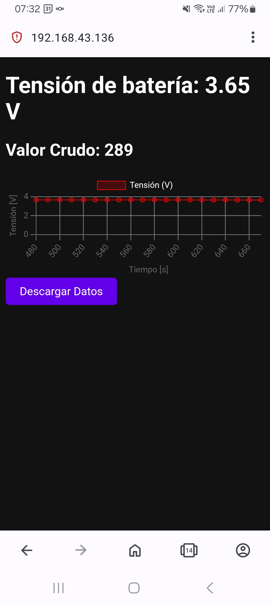

# Proyecto de Medición y Visualización de Tensión de Batería con ESP8266

Este proyecto utiliza un ESP8266 para medir la tensión de una batería en tiempo real y visualizar los datos a través de un gráfico en un servidor web. Los datos se almacenan en un archivo CSV y se pueden descargar en cualquier momento. El gráfico se actualiza automáticamente cada segundo, mostrando la evolución de la tensión de la batería con el tiempo.

## Características

- Medición en tiempo real de la tensión de la batería utilizando el pin A0 de ESP8266.
- Visualización de los datos en un gráfico interactivo utilizando la librería Chart.js.
- Los datos se guardan en un archivo CSV con delimitadores `;` y pueden ser descargados.
- Configuración de una interfaz web con diseño oscuro (modo nocturno).
- Líneas del gráfico y el grid en color gris para facilitar la visualización.

## Requisitos

- **Hardware:**
  - ESP8266 (como NodeMCU o cualquier otro modelo basado en ESP8266).
  - Sensor de tensión (por ejemplo, un divisor de voltaje o un sensor compatible con ESP8266).
  
- **Software:**
  - Arduino IDE con soporte para el ESP8266.
  - Librería `ESP8266WiFi` para la conexión Wi-Fi.
  - Librería `ESP8266WebServer` para crear el servidor web.
  - Librería `FS` para el acceso al sistema de archivos SPIFFS.

## Instalación

### 1. Configuración del entorno

1. Asegúrate de tener el **Arduino IDE** instalado en tu computadora.
2. Añade soporte para el **ESP8266** en el IDE de Arduino. En el menú de **Archivo > Preferencias**, agrega el siguiente URL en "Gestor de URLs adicionales de tarjetas":
3. En el **Gestor de placas** (Herramientas > Placa > Gestor de placas), busca y selecciona **ESP8266**.

### 2. Cargar el código en el ESP8266

1. Conecta tu ESP8266 a la computadora mediante un cable USB.
2. Abre el código en el Arduino IDE.
3. En el menú **Herramientas > Placa**, selecciona tu modelo de ESP8266.
4. Selecciona el puerto adecuado en **Herramientas > Puerto**.
5. Carga el código al ESP8266.

